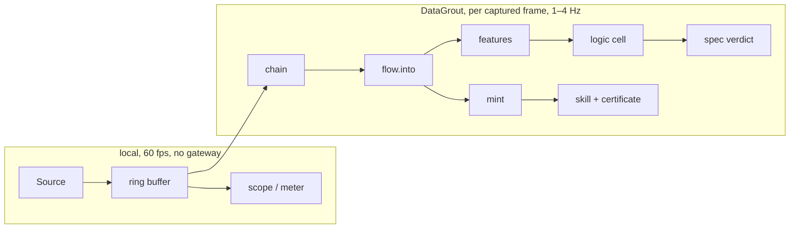

# Bench

A DSP workbench that runs on [DataGrout](https://datagrout.ai).

Bench is a real bench instrument: live scope, meter, spectrum, and a
declarative pass/fail spec. It doubles as a reference example of building a
deterministic application on the DataGrout gateway and as a visual way to
test and verify the signal and linalg suites. The only DG primitives used
are the ones needed by a given instrument.


*The [two-tone spectrum](bench-core/examples/profiles/two-tone-spectrum.bench) profile, one
Analyse after launch. `dgbench --profile bench-core/examples/profiles/two-tone-spectrum.bench`
opens Bench in this state.*



## What it demonstrates

- **Where a remote tool gateway belongs in a realtime loop.** The trace is drawn
  locally at frame rate; DG runs on captured frames. A round trip per sample is
  not an oscilloscope, and the architecture says so out loud.
- **Chains as portable plans.** The pipeline you build by hand compiles to the
  same `flow.into` plan an agent would submit, then mints as a reusable skill
  with a Cognitive Trust Certificate.
- **Rules over measurements.** Derived features land in a logic cell as facts, so
  a pass/fail spec is *derived*, not computed in app code, at zero token cost,
  and exposable as an HTTP endpoint.
- **A local skill endpoint.** Minted skills are served at
  `127.0.0.1:<port>/skills/<slug>` so your other local apps can call them while
  you develop an integration.

## Status

End-to-end. Sign in with browser consent (OAuth 2.1 authorization code +
PKCE), build a chain, press Analyse, and every stage is charted, with the
measurements folded into the meter. Or switch on auto, which runs the chain
against the gateway at a rate you choose, with the credit cost per minute shown
beside the toggle.

Working: the function generator with stackable components, presets and a noise
floor; a scope with a selectable time base and a shaded analysis frame; the
meter; the chain builder with shape typing, per-step results and per-step
errors; derived features, spec rules, skill minting, the loopback skill
endpoints; and a Smart Panels picker that places the account's panels into a
resizable dock.

The chain offers fifteen steps from the `signal.*`, `linalg.*` and `math.*`
suites: FIR and biquad filters, Hilbert envelope, rational resampling,
spectrum, convolution, correlation (by lag or as `acf`/`pacf`), delay
embedding, peak finding, PCA, clustering, and rolling-window statistics. The
FIR filter runs causal, because a live trace must not answer before the
signal does; every filter step states its delay or look-ahead in samples. Panel loading is explicit and priced: the list is one call, and
full rows are one query per data panel, so each is a button that says what it
costs rather than something that happens on connect.

Also working, behind the `audio` feature: live audio input as the signal source.
The Signal pane's source menu lists the machine's input devices; pick one and
the scope shows it, with channel, gain and a level meter. A USB audio interface
is the cheapest way to get a real external signal in. Line level is about
±1 full scale, so keep inputs under ±2 V and divide 10:1 above that.

Also: the meter reads frequency, period and duty cycle off the analysis frame
locally, every frame, with the chain's dominant frequency and THD beside them;
"Save capture" writes the frame to `~/Documents/Bench/captures` as WAV and
CSV; and dropping a WAV or CSV on the window replays it as the signal source,
looping, at its own sample rate.

**Profiles.** The whole setup saves as one `.bench` file (JSON) and comes back
with one action: the source and its knobs, the chain and its arguments, time
base, analysis frame, trigger, and the placed panels. The Profiles menu lists
the examples shipped in [`bench-core/examples/profiles/`](bench-core/examples/profiles/), anything saved under
`~/Documents/Bench/profiles`, and a box to save the current setup. A dropped
`.bench` loads too, and so does `dgbench --profile path.bench`. A profile
never turns auto-analysis on: it stores the rate, and the switch stays yours.
Each shipped profile is also a worked example of a chain an agent would
submit, with a description of what the result should show.

Not yet wired into the UI: channels (several sources overlaid), the Spec and
Skills panes, snap-to-slot panel layout, and dispatching panel form actions to
the gateway.

## Roadmap, and where it stops

Bench is a reference instrument, not a product. It consumes DataGrout and
demonstrates it; it never becomes a place where things are authored, stored or
sold. The remaining work is:

- **Save as skill** from the chain pane: the chain is already the plan an
  agent submits, and the engine already mints.
- **Channels**: several sources overlaid, each with its own colour and frame,
  the way a multi-channel scope works. Audio input and replay become channels.
- **Serial source**: a microcontroller ADC over USB serial, DC-coupled.
- Remaining polish: a moving-average width handle, Alt-snap for the gate,
  vertical scale and offset.

Anything beyond that needs a reason of the form "the gateway needs it shown"
or "a real signal broke it".

## Build

```bash
cargo run -p bench-gui
```

The binary is `dgbench` (the app is Bench; a binary called `bench` would sit
next to `cargo bench` in every shell history). To open already set up:

```bash
cargo run -p bench-gui -- --profile bench-core/examples/profiles/two-tone-spectrum.bench
```

Optional signal sources are feature-gated and off by default, so a fresh clone
builds with no system audio libraries present:

```bash
cargo run -p bench-gui --features audio
```

### Building from a clone

Every DataGrout dependency comes from crates.io, so a clone builds on its own.
The gateway client is
[`datagrout-conduit`](https://crates.io/crates/datagrout-conduit), whose
`authcode-loopback` feature is the browser sign-in; panel rendering is
[`datagrout-panels`](https://crates.io/crates/datagrout-panels) and
[`datagrout-panels-egui`](https://crates.io/crates/datagrout-panels-egui).

```bash
git clone https://github.com/DataGrout/bench
cd bench && cargo run -p bench-gui
```

On macOS, `scripts/bundle-macos.sh` wraps the release binary in `Bench.app`
so the menu bar shows the app's name and audio input can ask for microphone
permission; an unbundled binary shows a placeholder menu title.

On Linux the GUI needs the usual egui system libraries and the `audio` feature
needs ALSA headers; the CI workflow lists the packages.

On Windows nothing extra is needed: audio input goes through WASAPI and TLS is
rustls, so `cargo run -p bench-gui --features audio` is the whole build. CI
covers all three platforms, each with and without audio.

Sign-in state is kept in `~/.config/bench/credentials.json` (`%APPDATA%\bench\`
on Windows). It holds an OAuth refresh token: treat it like a password, and
"Sign out" deletes it. Captures and profiles go under `~/Documents/Bench`
everywhere.

## Layout

| crate | role |
|---|---|
| `bench-core` | sources, ring buffer, chain compiler, gateway seam, features, spec |
| `bench-serve` | loopback HTTP: `/api/query`, `/api/action`, `/skills/:slug` |
| `bench-gui` | the eframe application |
| `bench-core/examples/profiles/` | example `.bench` profiles, compiled into the Profiles menu |
| `docs/` | the README screenshot |

Panel rendering lives in
[`datagrout-panels`](https://github.com/DataGrout/smart-panels).

## License

`MIT OR Apache-2.0`, at your option.
